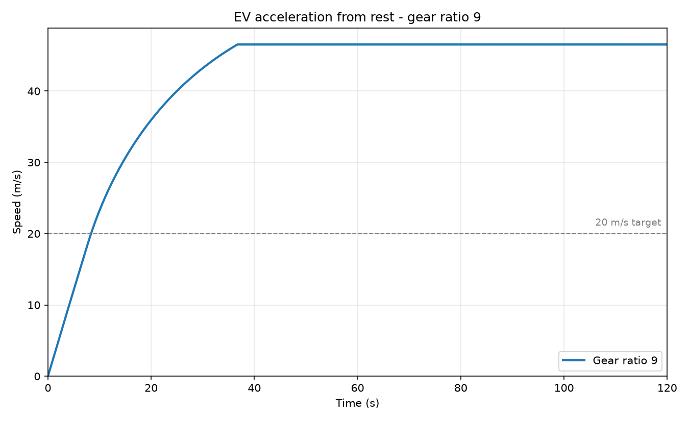
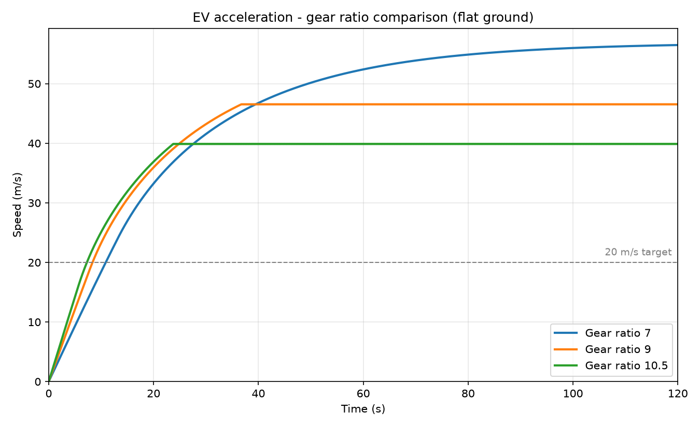
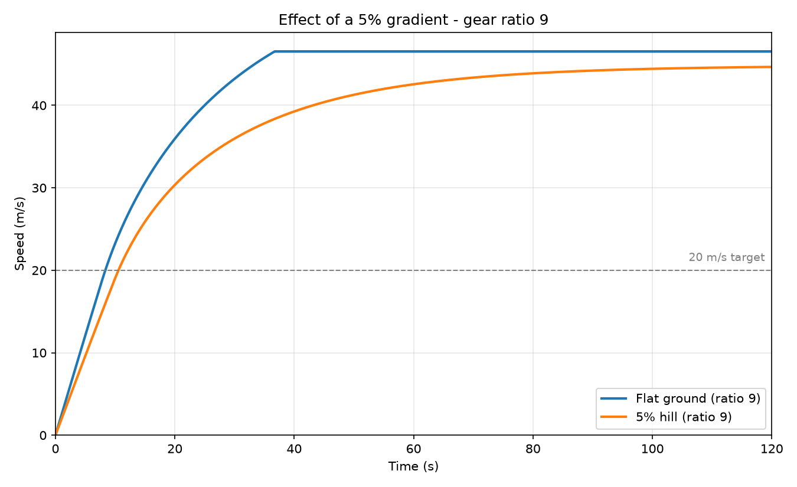

# EV Powertrain Simulation — Report

**Challenge 3: Programming** — simulating an electric vehicle accelerating from rest at full throttle.

Implements "Approach 2: Dynamic Calculations" from the [reference blog](https://technoo7blogs.blogspot.com/2022/01/electric-vehicle-powertrain.html).
All results below are produced by [`ev_sim.py`](ev_sim.py); run it with `python ev_sim.py` to reproduce them.

---

## Vehicle and motor parameters

| Parameter | Value |
|---|---|
| Mass | 2,000 kg |
| Rolling resistance coefficient | 0.01 |
| Drag coefficient | 0.30 |
| Frontal area | 2.5 m² |
| Air density | 1.2 kg/m³ |
| Gravity | 10 m/s² |
| Tire radius | 0.4 m |
| Drivetrain efficiency | 90% |
| Motor peak torque | 250 N·m (up to 4,000 rpm) |
| Motor constant-power region | 4,000 – 10,000 rpm |
| Time step | 0.01 s, simulated to 120 s |

---

## Checkpoint

The brief states that with a gear ratio of 9 the vehicle should be travelling about 2.4 m/s after 1 second.

| | Speed at t = 1 s |
|---|---|
| Expected | ≈ 2.4 m/s |
| **Simulated** | **2.431 m/s** ✅ |

This is asserted inside `main()`, so the program fails loudly if a later change breaks the force chain.

It is also easy to confirm by hand. At rest the motor is at 0 rpm, so it makes its full 250 N·m:

```
F_tractive  = 250 × 9 × 0.9 / 0.4  = 5,062.5 N
F_rolling   = 0.01 × 2000 × 10     =   200.0 N
F_drag      = 0 (the car is not moving yet)
a           = (5062.5 − 200) / 2000 = 2.43 m/s²
```

The motor is still well below 4,000 rpm one second later, so acceleration is nearly unchanged over that first second and the speed lands at essentially 2.43 m/s.

---

## Task 1 — Gear ratio 9



The curve has three distinct phases, and each one is a region of the motor's torque curve:

1. **Straight ramp (0 – ~8.6 s)** — the motor is below 4,000 rpm and making full torque, so acceleration is nearly constant. It tapers only slightly as aerodynamic drag builds.
2. **Bending over (~8.6 – 36 s)** — the motor has passed 4,000 rpm and entered constant power. Torque now falls as speed rises, while drag keeps growing, so acceleration decays.
3. **Flat (36 s onward)** — the motor has hit its 10,000 rpm redline and can make no more torque. Speed is pinned at 46.55 m/s.

---

## Task 2 — Results for all three gear ratios

Flat ground, from a standstill at full throttle:

| Gear ratio | Time to 20 m/s | Top speed | Top speed set by |
|---:|---:|---:|---|
| 7 | 10.88 s | 56.49 m/s | drag / power |
| 9 | 8.36 s | 46.55 m/s | motor rpm limit |
| 10.5 | **7.29 s** | 39.90 m/s | motor rpm limit |



The three curves cross over each other, which is the tradeoff made visible: ratio 10.5 leads off the line, ratio 9 overtakes it at about 24 s, and ratio 7 eventually passes both.

**Verifying the top speeds.** Each figure above was checked against algebra the simulation never used. A gear ratio caps top speed two different ways, and whichever cap is lower is the one that binds:

| Gear ratio | Redline ceiling | Drag/power ceiling | Lower one | Simulated |
|---:|---:|---:|---|---:|
| 7 | 59.84 m/s | 56.89 m/s | drag/power | 56.49 m/s |
| 9 | 46.54 m/s | 56.89 m/s | redline | 46.55 m/s |
| 10.5 | 39.89 m/s | 56.89 m/s | redline | 39.90 m/s |

Ratios 9 and 10.5 match their redline ceiling to within 0.01 m/s. Ratio 7 is the interesting one: it never reaches its redline, because drag stops it first. It approaches its 56.89 m/s ceiling asymptotically and is still 0.4 m/s short when the 120 s simulation ends — it is still very slowly accelerating.

---

## Task 3 — The tradeoff the gear ratio creates

A higher gear ratio multiplies motor torque at the wheels, so the car launches harder — ratio 10.5 reaches 20 m/s in 7.29 s versus 10.88 s for ratio 7. But the same ratio also spins the motor faster for any given road speed, so the motor runs into its 10,000 rpm redline at a much lower speed, capping top speed at 39.90 m/s instead of 56.49 m/s. The gear ratio therefore trades acceleration against top speed: it cannot improve both, because it multiplies torque and motor rpm by the very same number, and a single-speed EV has to pick one point on that compromise.

---

## Task 4 — Does the simulation agree with Challenge 2?

**No.** Challenge 2 calculated that a gear ratio of 7 reaches 20 m/s in 10 seconds. This simulation gives **10.88 s** — about 9% slower.

### The reason: Challenge 2 does not include drivetrain efficiency

Challenge 2's parameter list has no efficiency term. Challenge 3 adds one: 90%. That single difference accounts for the gap.

Reconstructing Challenge 2's method:

```
a        = 20 / 10                        =     2 m/s²
F_accel  = 2000 × 2                       = 4,000 N
F_roll   = 0.01 × 2000 × 10               =   200 N
F_drag   = 0.5 × 1.2 × 0.3 × 2.5 × 20²    =   180 N
F_total                                    = 4,380 N
τ_wheel  = 4380 × 0.4                     = 1,752 N·m
gear ratio = 1752 / 250                   = 7.008  ≈ 7
```

Now compare the force a gear ratio of 7 actually delivers, with and without the efficiency term:

| | Wheel force at full torque |
|---|---:|
| Challenge 2 (no efficiency): `250 × 7 / 0.4` | 4,375 N |
| Challenge 3 (90% efficiency): `250 × 7 × 0.9 / 0.4` | 3,937.5 N |

Challenge 2's 4,375 N matches the 4,380 N its own method demands — its arithmetic is perfectly self-consistent. But 10% of that force is lost in the drivetrain before it reaches the road, leaving 3,937.5 N. The car is simply under-geared for a 10-second target once losses are counted. Solving for the ratio that *would* hit 10 s including efficiency gives `1752 / (250 × 0.9)` ≈ **7.8**, not 7.

This is not a quirk of the challenge — the blog's own worked example does exactly the same thing and then says so explicitly:

> *"The above values are calculated without considering efficiency. Assuming 85% overall efficiency, the above values are multiplied by 1.15."*

So the sizing calculation is meant to be corrected for efficiency afterwards. Challenge 2 stops before that correction; Challenge 3 builds it in from the start.

### A second, smaller difference

Challenge 2 evaluates aerodynamic drag once, at the final speed of 20 m/s, giving 180 N, and treats it as constant for the whole run. The simulation instead recomputes drag at every 0.01 s step from the instantaneous speed, so it is near zero at launch and only reaches 180 N at the very end.

This effect works in the *opposite* direction, and it is much smaller than the efficiency effect. Setting the simulation's efficiency to 100% — exactly Challenge 2's assumption — gives **9.73 s**, which lands just *below* its 10 s rather than above. The remaining 0.27 s gap is this drag simplification: the hand calculation charges the car a constant 180 N of drag from the very first instant, when in reality drag is near zero at launch.

So the two differences bracket Challenge 2's answer from either side (9.73 s and 10.88 s), and efficiency is clearly the dominant one — it accounts for 1.15 s of difference against 0.27 s for the drag treatment.

---

## Bonus — Launching up a 5% hill

Adding the blog's gradient resistance, `F_gradient = m · g · sin(θ)` with `θ = atan(0.05)`, puts a constant extra **998.8 N** of resistance on the car — equivalent to about 0.5 m/s² of lost acceleration.

| Gear ratio | Time to 20 m/s (flat) | Time to 20 m/s (5% hill) | Top speed (flat) | Top speed (5% hill) |
|---:|---:|---:|---:|---:|
| 7 | 10.88 s | 14.94 s | 56.49 m/s | 44.62 m/s |
| 9 | 8.36 s | 10.56 s | 46.55 m/s | 44.66 m/s |
| 10.5 | 7.29 s | 8.92 s | 39.90 m/s | 39.90 m/s |



Two things worth noting:

- **The hill hurts the low ratio most.** Ratio 7 loses 4.06 s to the hill while ratio 10.5 loses only 1.63 s, because ratio 7 has the least wheel force to spare against a constant 998.8 N penalty.
- **Ratio 10.5's top speed does not change at all.** It is limited by the motor's redline, not by force, and the redline occurs at the same road speed regardless of slope. Ratios 7 and 9, which have force to spare on the flat, both drop to roughly 44.6 m/s — on the hill they are no longer redline-limited but force-limited, so they converge on nearly the same value.

---

## Notes from reading the blog

Two details worth recording, since both could silently produce wrong answers:

- **The speed formula uses tire *diameter*, not radius.** The blog writes `N_wheel = 60V/(πD)` with `D` defined as tire diameter, so `D = 0.8 m` here. Using the 0.4 m radius instead would double every rpm in the model.
- **There is a typo in the blog's Approach 2 description.** It says wheel torque is *"multiplied with tire radius to get Force Produced at wheels"*. Force is torque *divided* by radius — which is what the blog's own formula list (`F_tractive = τ_wheel / r_tire`) and its worked Ather example both do. The code divides.

---

## Assumptions and limitations

- Flat ground except in the bonus section.
- No traction limit — the model assumes the tires can always transmit the requested force without slipping. At launch with ratio 10.5 this is optimistic.
- No motor thermal derating; peak torque is available indefinitely.
- Instantaneous torque response, with no inverter or controller dynamics.
- Rotational inertia of the motor, gearbox and wheels is ignored; only the vehicle's translational mass is accelerated.
- Forward Euler integration at dt = 0.01 s. The speed curves are smooth and settle cleanly onto their ceilings rather than oscillating, which indicates the step size is small enough.
